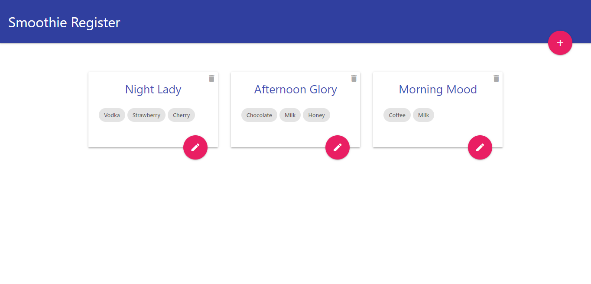
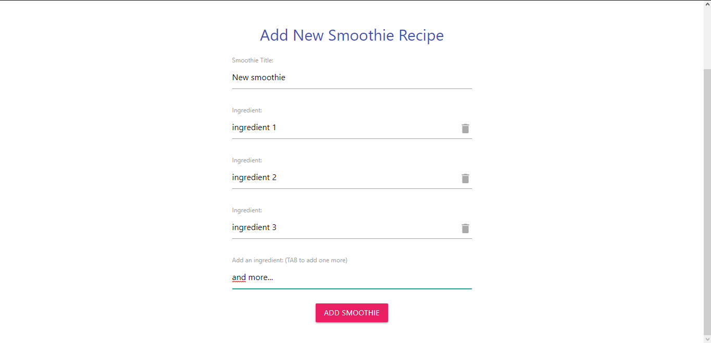
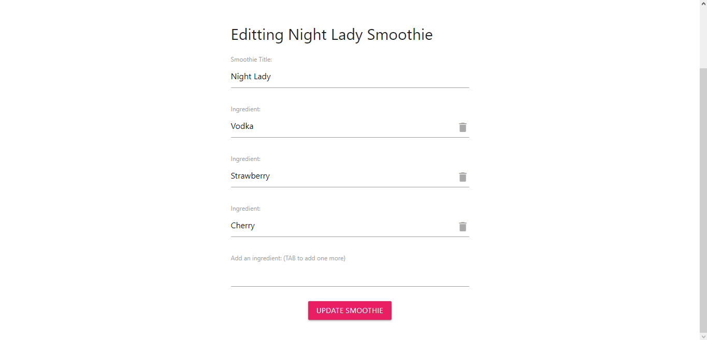

# Project Smoothies Register
> A Vue.js project

- Frontpage


- Creating a smoothie


- Editting a smoothie


## Access the app
To access the hosted app [click here](https://vuejs-project-ninja-smoothies.firebaseapp.com)

## Build Setup
To use the root files, follow the steps below:
``` bash
# install dependencies
npm install

# serve with hot reload at localhost:8080
npm run dev

# build for production with minification
npm run build

```
> Project design by The Net Ninja
> Code refactoring and management by Gabriel Cavalcante

